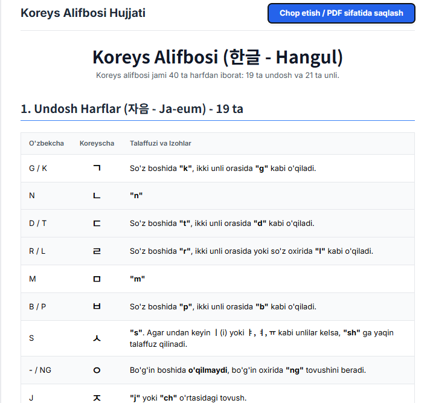

Koreys Alifbosi - Chop etish uchun Veb-sahifa
Ushbu loyiha koreys tilini o'rganishni boshlaganlar uchun qulay vosita bo'lib, koreys alifbosi (Hangul) haqidagi barcha ma'lumotlarni o'z ichiga olgan, chop etishga moslashgan bitta HTML sahifadan iborat.

Sahifada undosh va unli harflar, ularning o'zbekcha talaffuzi va asosiy qoidalar jadvallar ko'rinishida keltirilgan.

✨ Xususiyatlari
To'liq Ma'lumot: Barcha 40 ta harf (19 undosh, 21 unli) va ularning talaffuz qoidalari.

Chop etishga Qulaylik: "Chop etish / PDF sifatida saqlash" tugmasi orqali sahifani osongina qog'ozga chiqarish yoki PDF formatida saqlab olish mumkin.

Zamonaviy Dizayn: Tailwind CSS yordamida yaratilgan toza va o'qish uchun qulay interfeys.

Moslashuvchan (Responsive): Har qanday qurilma ekraniga moslashadi.

Shaxsiylashtirilgan Suv Belgisi: Hujjatga shaxsiy imzo sifatida "abdulloh" degan suv belgisi qo'shilgan.

🚀 Qanday foydalanish kerak?
Loyiha fayllarini kompyuteringizga yuklab oling yoki git clone qiling.

index.html (yoki faylning nomi qanday bo'lsa) faylini brauzerda oching.

Sahifaning yuqori qismidagi "Chop etish / PDF sifatida saqlash" tugmasini bosing.

Ochilgan oynada printerni tanlang yoki "Save as PDF" opsiyasini tanlab, faylni saqlang.

🛠️ Foydalanilgan Texnologiyalar
HTML5: Sahifaning asosiy strukturasi uchun.

Tailwind CSS: Dizayn va stillar uchun.

Google Fonts: Matnlar va suv belgisi uchun chiroyli shriftlarni ulash uchun.

JavaScript (minimal): Chop etish funksiyasini ishga tushirish uchun.

📝 Litsenziya
Ushbu loyiha ochiq kodli bo'lib, bemalol foydalanishingiz, o'zgartirishingiz va tarqatishingiz mumkin.

